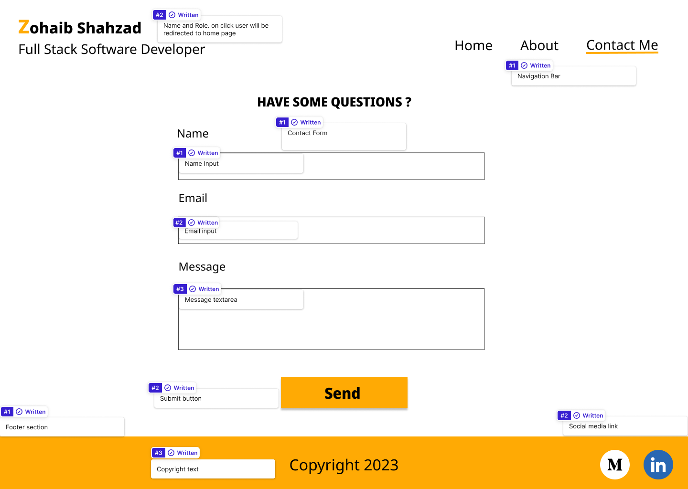

# My Porfolio Site

Welcome to the repository for my personal portfolio! This compilation provides an extensive overview of my passions, background, and abilities. You may learn more about my accomplishments, work history, and projects below, which demonstrate my enthusiasm and skill across a range of industries. Whether you're looking to collaborate with me, find a job, or are just interested in my work, this repository provides a comprehensive look into my abilities, inventiveness, and commitment. Please feel free to look around and see the variety of projects that help to shape my personality both personally and professionally. I appreciate you stopping by, and I hope my portfolio helps you understand my strengths and goals.

Experience the magic of the live site by simply clicking right here - <a href="https://zohaibshahzadkhan.github.io/Portfolio/" target="_blank"> My Portfolio </a>

# Creating Exceptional Moments: Revealing the User-Centered Tale of Zohaib

Welcome to the world of my own user experience story. Come along on a trip where deliberate design meets user enjoyment, creating digital experiences that have a lasting impression.

## Target Audience
* Employers and Recruiters 
* Clients and Customers
* Collaborators and Partners
* Networking Contacts
* Educators and Mentors
* Peers and Colleagues
* Personal Branding
* Students and Aspiring Professionals
* General Audience

## User Stories

1. As a employers and recruiters 

    * <b>Story:</b> As a recruiter, I want to easily navigate through the candidate profolio site to learn the candidate's background, work experiences, and achievements so that I can assess their suitability for the position. 

    * <b>Story:</b> As a recruiter, I want to hear candidate introduction on the landing page so that I can understand more about candidates interest if they aligned with company goals. 

2. As a Potential Client:

    * <b>Story:</b> As a potential client, I want to view social media networks like LinkedIn profile and Medium posts that shows candidate's pofile and projects to evalute their expertise and findout if they align with my project requirements. 

3. As a Networking Contact:

    * <b>Story:</b>  As a networking contact, I want to quickly understand the candidate's professional background and accomplishments to determine the potential value of connecting with them and contact them via contact form.
    * <b>Story:</b>  As a user once I contact candidate I should be notified with a thankyou message so than I know that my message has been sent.

4. As a Student or Aspiring Professional:

    * <b>Story:</b>   As a student or aspiring professional, I want to explore the candidate's career path, learn from their experiences, and gain insights into industry trends to guide my own journey.

5. As a General Audience:

    * <b>Story:</b>   As a general audience member, I want to navigate through the portfolio easily and enjoyably, discovering the candidate's personality, passions, and the impact of their work in a way that is accessible and engaging.

## Wireframes

 In order to facilitate a systematic approach towards the implementation of user needs and goals throughout the web development process, the selected designs have been strategically mapped with relevant user story numbers. This carefully designed integration shall provide for a user oriented design, which complies with the identified requirements set out in each user story.

### Architecting an Intuitive Desktop and Mobile Experience: Unveiling the Wireframe Blueprint 

| Home page Desktop view                                                                    |                                                                   Home page mobile view | Mapped to user story |
| :---------------------------------------------------------------------------------------- | --------------------------------------------------------------------------------------: | :------------------: |
|  |  |   <b>(1, 2, 5)</b>   |

| About page Desktop view                                                                   |                                                                   About page mobile view | Mapped to user story |
| :---------------------------------------------------------------------------------------- | ---------------------------------------------------------------------------------------: | :------------------: |
|  |  |   <b>(1,2,4,5)</b>   |

| Contact page Desktop view                                                                      |                                                                   Contact page mobile view | Mapped to user story |
| :--------------------------------------------------------------------------------------------- | -----------------------------------------------------------------------------------------: | :------------------: |
|  |  |      <b>(3)</b>      |

# Features

My portfolio website is designed to emulate a traditional website structure, ensuring a seamless and instinctive user journey that captivates users and encourages further exploration.

On each page, a distinct heading welcomes visitors. The language, color palette, and design choices are deliberately chosen to convey a friendly and easily comprehensible atmosphere.

## Navigation

* A concise introduction presenting Zohaib Shahzad as a Full Stack Software Developer with a clear focus on key areas of expertise.

* Easy navigation with categorized sections Home, About, Contact Me, for a seamless user experience.

* Each active link is accompanied by a highlighter, enhancing accessibility.

* Top left in the navigation bar, the clickable logo seamlessly takes you back to the homepage.

* With two versions for different screens, the navigation bar maintains consistent color and design styles, ensuring a smooth user experience.

**Navigation bar on Desktop view**

---
**Navigation bar on Mobile view**

## Home
* The Home Page serves as the initial impression for visitors, designed to be inviting and clearly communicate my mission.

* My profile picture on the home page serves as the virtual handshake, creating an immediate and personal connection with users. Profile picture  conveys authenticity, and humanizes the online experience, making visitors more likely to engage and connect with me. In essence, it becomes a pivotal element in shaping the first impression and establishing a meaningful rapport with the audience.

* Just below my mission, a snippet of content, a thoughtfully chosen quote, provides a glimpse into the website's ethos, setting the tone for the user.

* My introductory audio journey is a captivating gateway for users into the essence of my personality and professional journey. The audio format adds a dynamic and engaging layer, allowing visitors to connect with my story on a more personal level. The tone, inflection, and narrative in my audio introduction create a memorable and immersive experience, leaving a lasting impact on users. This unique touch enhances the overall user experience, making my portfolio more distinctive and relatable.

* Concluding the Home Page is a Stories section featuring four testimonials, adding authenticity and personal branding, showcasing my mission and journey.

* Each section is responsive, seamlessly adjusting to different screen sizes while maintaining a visually appealing layout. The overall goal is to create a warm and friendly impression, enticing users to explore further, ultimately leading them to the Contact Page.

**Home page on Desktop view**

---

**Home on Tablets**

---

**Home on Mobile view**

## About

* Detailed Work Experience: Clearly outlined work experiences, providing insights into roles, responsibilities, and key achievements at Edge Case Research and TerraLoupe.

* Highlighting Skills: Demonstrates proficiency in developing user-centric web applications, expertise in technologies such as Vue, Vuex, React.js, Redux, and Django, and specialized knowledge in cloud platforms like AWS, Microsoft Azure, Google Cloud, and Oracle Cloud.

* Clickable Company Logos: Enhances user accessibility with clickable logos of Edge Case Research and TerraLoupe, allowing visitors to easily access detailed company profiles and explore my contributions and achievements in each role.

* Project Highlights: Main highlights under each work experience detail key projects, technologies used, and specific achievements, giving users a comprehensive understanding of my capabilities and contributions.

* Timeline Presentation: A clear timeline format for work experience, offering a chronological view that aids in understanding the progression of my career.

These features collectively enhance the user experience, making it convenient for the target audience to navigate through my professional journey, explore my skills, and access details about my past work and reach out to companies I work with with a single click on the company logos.

**About page on Desktop view**

---

**About on Tablets**

---

**About on Mobile view**

## Contact Me
* User-Friendly Form: An intuitive form with fields for name, email, and message, providing a straightforward means for visitors to submit their inquiries or messages.

* Effortless Submission: Upon hitting the "Submit" button, users are seamlessly redirected to a dedicated "Thank You" page, acknowledging the successful submission of their message.

* Automated Confirmation: The "Thank You" page automatically redirects users back to the home page after a brief 10-second interval, ensuring a smooth and timely transition.

* Form Validation: Incorporates form validation to ensure  complete user inputs and enhancing the overall submission process.

* Efficient Communication: Facilitates direct communication by collecting essential information such as name and email, allowing me to respond promptly and effectively to inquiries.

* Enhanced User Experience: Simplifies the interaction process, making it convenient for my target audience to reach out, ask questions, or express interest, contributing to an overall positive user experience.

* Acknowledgment of Submission: The "Thank You" page serves as a confirmation, assuring users that their messages have been received successfully, providing a sense of reassurance and professionalism.

These features, coupled with form validation, collectively contribute to an efficient and user-centric contact page, fostering effective communication, minimizing errors, and encouraging engagement with my target audience

**Contact page on Desktop view**

---
**Thank you page on Desktop**

---

**Contact on Mobile**

---
**Thank you page on Mobile**

---

**Footer Features:**

- Copyright Information: Clear and visible copyright text, providing legal protection for my content and emphasizing ownership.

- Social Media Links: Clickable icons for Medium and LinkedIn, enabling users to easily connect with me on these platforms for additional insights into my professional activities.

- Professional Networking: LinkedIn profile link for users to connect professionally, and stay updated on my professional journey.

- Brand Consistency: Maintains consistency with the overall design and color scheme of my portfolio, contributing to a cohesive and visually appealing presentation.

- Engagement Opportunities: Provides users with multiple avenues to engage with my content—whether through professional networking on LinkedIn or exploring in-depth thoughts on my Medium blog.

- Accessibility: Offers a convenient and accessible way for users to access additional content and stay informed about my professional updates.

- Enhanced User Experience: The footer acts as a navigational aid, enhancing the overall user experience by offering quick and direct access to relevant external content.

These features collectively enrich the footer section, making it a valuable resource for my target audience to connect, engage, and stay updated with my professional content and activities.

**Footer section on all devices**

# Future Features
Outline of Upcoming Features:

1. **Enhanced User Interface:** We plan to revamp the user interface to create a more visually appealing and user-friendly experience, ensuring seamless navigation.

2. **Expanded Portfolio Showcase:** Adding new projects and accomplishments to provide a comprehensive overview of my evolving skill set and professional journey.

3. **Interactive Timeline:** Introducing an interactive timeline feature to showcase the chronological progression of my experiences, making it easier for visitors to understand my career trajectory.

4. **Skill Proficiency Badges:** Incorporating visually striking badges to highlight proficiency levels in various skills, providing a quick and engaging overview of my expertise.

5. **Blog Integration:** Integrating a blog section to share insights, industry trends, and personal reflections, fostering a deeper connection with the audience.

6. **Client Testimonials:** Including a dedicated section for client testimonials to build credibility and showcase positive experiences from collaborators and clients.

7. **Expanded Contact Options:** Providing additional contact options, such as a direct messaging system or scheduling tools, to facilitate convenient communication with visitors.

8. **Project Pages:** Introducing dedicated project pages to showcase a detailed overview of each project, offering in-depth insights into the challenges, solutions, and outcomes.

9. **Downloadable CV Option:** Adding the option for users to download my CV directly from the website, making it convenient for potential employers and collaborators to access my credentials.

These planned features aim to elevate the overall user experience, highlight achievements more effectively, and offer a more dynamic and interactive portrayal of my professional journey.

## Testing 

### Browser Testing

**Layout:** Testing layout and appearance of site for consistency throughout browsers.

**Functionality:** Ensuring all links, navigation and form submit functions as expected throughout browsers.

| Browser | Layout | Functionality |
| :-----: | :----: | :-----------: |
| Chrome  |   ✔    |       ✔       |
| Firefox |   ✔    |       ✔       |

### Testing User Stories

|                                                                                                           Expectation                                                                                                            |                                                                                                                                    Result                                                                                                                                    |
| :------------------------------------------------------------------------------------------------------------------------------------------------------------------------------------------------------------------------------: | :--------------------------------------------------------------------------------------------------------------------------------------------------------------------------------------------------------------------------------------------------------------------------: |
|          As a recruiter, I want to easily navigate through the candidate profolio site to learn the candidate's background, work experiences, and achievements so that I can assess their suitability for the position.          |   As a recruiter, I can quickly read through the main content of the home and about page and find out my mission, interests and work experices     Evidence:         |
|                              As a recruiter, I want to hear candidate introduction on the landing page so that I can understand more about candidates interest if they aligned with company goals.                               |                                    As a recruiter, I can find the  introductory audio on the home page where I can easily listen to candidates introduction       Evidence:                                      |
| As a potential client, I want to view social media networks like LinkedIn profile and Medium posts that shows candidate's pofile and projects to evalute their expertise and findout if they align with my project requirements. |                             As a potential client, I can find the social media links on the footer section on each page which redirect me to particular social media platform      Evidence:                               |
|          As a networking contact, I want to quickly understand the candidate's professional background and accomplishments to determine the potential value of connecting with them and contact them via contact form.           |                                         As a networking contact, I find find work experince on seprate about page and contact via contact form page          Evidence:                                           |
|                                                  As a user once I contact candidate I should be notified with a thankyou message so than I know that my message has been sent.                                                   |                                                     As a visitor, I can clearly see acknowledgement message when I submit contact details      Evidence:                                                       |
|                       As a student or aspiring professional, I want to explore the candidate's career path, learn from their experiences, and gain insights into industry trends to guide my own journey.                        |                                                                  As a student , I can find the career details on the about page         Evidence:                                                                    |
|      As a general audience member, I want to navigate through the portfolio easily and enjoyably, discovering the candidate's personality, passions, and the impact of their work in a way that is accessible and engaging.      | As a visitor, I can easily navigate to different site pages on different devices and find more information mentioned in candidates portfolio candidate      Evidence:   |

 
## Deployment

 This website was deployed on GitHub Pages through the following steps:

- Navigate to **Settings** from the GitHub repository.
- In the left-hand navigation, select **Pages**.
- In the source section drop-down menu, change the branch from **none** to **main**, and click **Save**.
- After a few minutes, the website goes live and automatically refreshes with each Git push command.

You can access the live site [here](https://zohaibshahzadkhan.github.io/Portfolio/).

To run it locally:

- Log into GitHub and click on the repository to download ([zohaib-portfolio](https://github.com/zohaibshahzadkhan/Portfolio)).
- Select **Code** and click "Download ZIP file."
- Once the download is complete, extract the ZIP file and use it in your local environment.

Alternatively, you can **Clone** or **Fork** this repository into your GitHub account.

## Credits

### Media

Text to speech audio was generated through textmagic:
- [Text Magic](https://freetools.textmagic.com/text-to-speech)

Favicon images were downloaded from the following site:
- [Icons8](https://icons8.com/icon/TImKb7W8Xrh7/portfolio)

SVG for social media was downloaded by 
- [Social media icons 20223](https://www.figma.com/file/NYS5Ag49IU2i8vujNFl1j3/Social-Media-Icons-(Community)?type=design&node-id=0-1&mode=design&t=SEJ4TtCteFvulRyG-0)

### Content
Fonts were taken from
- [Google fonts](https://fonts.google.com/)